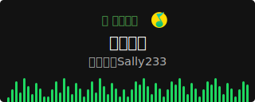

<!-- https://github.com/saturn-abhishek/awesome-github-profile-readme -->

# Hi there!  <small style="float:right; font-size: .6em;margin-top:1em;"><a href="https://imjeen.github.io">Blog</a> • <a href="https://github.com/imjeen">@imjeen</a></small>

###  About Me:

- 🧑🏻‍💻 I’m working on **a company with AI-driven image-and-video processing technologies**
- 🌴 I’m learning about **Flutter, WebGL and Go**
- 💬 Ask me about **Vue/React, TypeScript and Node**
- 🐳 Moreover: I'm always looking for something valuable and meaningful to do
- 🧑‍💻 Tech I work on :
  <!-- https://github.com/tandpfun/skill-icons -->
  

     
  

---

<!-- https://streak-stats.demolab.com/demo/ -->

 
 

<h2 align="center">🤝 Support</h2>

🎀 Contributions (<a href="https://guides.github.com/introduction/flow">GitHub Flow</a>), 🔥 issues, and 🥮 feature requests are most welcome!

💙 If you like my projects, Give them ⭐ and Share it with friends!

<h2 align='center'>⚡️<i>Stay Awesome!</i>⚡️</h2>

<!-- 

 -->

<!--music / 🌐WEBSITE: https://github.com/kittinan/spotify-github-profile -->

       

  

